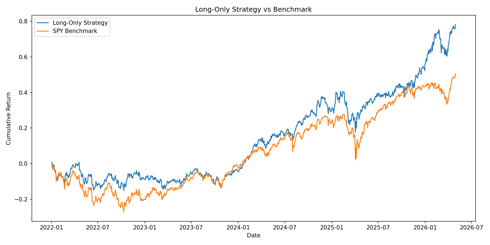
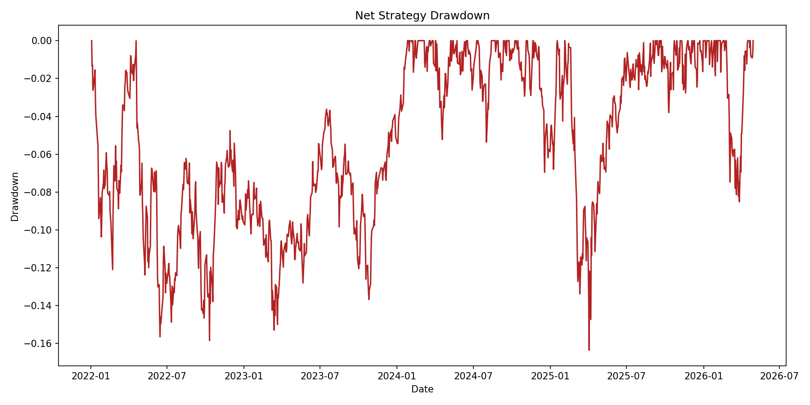

# S&P 500 Sector-Neutral Walk-Forward Multi-Factor Strategy

This project implements a sector-neutral S&P 500 multi-factor stock-selection backtest. It captures momentum and quality phenomena using a walk-forward optimization approach.

## 1. Entry Orders

### How to Enter a Position
- **Universe**: S&P 500 constituents.
- **Sector Neutrality**: Stocks are ranked within their respective GICS sectors.
- **Factor Scoring**: A combined score is calculated using four factors:
    - `momentum_252_21`: 12-month momentum (excluding most recent month).
    - `proximity_52w_high`: Distance from 52-week high.
    - `trend_quality_126`: Risk-adjusted 6-month return.
    - `momentum_60_5`: 3-month momentum (excluding most recent week).
- **Selection**: We buy the top 10% (decile) of stocks within each sector.
- **Execution**: Signals are generated at close `t`, and positions are entered at the open of `t+1`.
- **Rebalance Frequency**: Daily rebalance ensures maximum capital utilization and rapid response to signal changes.

### Parameter Choices & Reasoning
- **Top 10% Selection**: This fraction balances the need for alpha concentration (selecting only the best names) with the need for diversification across sectors.
- **Sector Neutrality**: By ranking within sectors, we eliminate sector bias and ensure the strategy is betting on stock-specific alpha rather than macro-sector rotations.
- **Walk-Forward Training (3 Years)**: We use the previous 3 years to calculate factor ICs and determine weights. This ensures the strategy adapts to changing market dynamics.
- **Daily Rebalance**: We optimized the rebalance frequency from weekly to daily to address the "under-exposure" issue identified in initial tests, ensuring the portfolio is always positioned in the highest-alpha names.

### Market Phenomena
The strategy captures **Momentum and Trend Quality**. It assumes that stocks with strong, high-quality price trends (low volatility relative to return) and those trading near their 52-week highs are likely to continue outperforming in the near term.

## 2. Exit Orders

### How to Exit a Position
- **Fixed Holding Period**: Positions are entered at `t+1` open and closed at `t+2` open (1-day holding period). Since we rebalance daily, we effectively rotate the portfolio every day.
- **Stop-Loss**: A hard stop-loss is set at **3%** below the entry price. If the day's low breaches this, the trade is closed immediately at the stop price.

### Trade Fates
Every trade is assigned one of three "fates":
- **`success`**: Trade closed with a positive return.
- **`stop-loss`**: Trade hit the 3% protective stop-loss.
- **`timeout`**: Trade closed at the end of the holding period with a flat or negative return (without hitting the stop-loss).

### Parameter Choices & Reasoning
- **3% Stop-Loss**: Optimized from 2% to allow for normal daily volatility while still providing a robust safety net against extreme adverse moves.
- **Daily Rotation**: Maximizes exposure to the most recent signals and ensures the strategy is "always on."

## 3. Performance & Analysis

### Key Performance Visualizations



### Key Metrics (Backtest Results 2022-2026)
| Metric | Value |
| :--- | :--- |
| **Total Return** | 78.13% |
| **Sharpe Ratio** | 0.92 |
| **Annualized Return (CAGR)** | 14.36% |
| **Max Drawdown** | -16.36% |
| **Expected Return per Trade** | 0.06% |
| **Average Trade Lifetime** | 1.0 Day |
| **Daily Hit Rate** | 53.78% |
| **Trade Success Rate** | 51.94% |
| **Timeout Rate** | 39.71% |
| **Stop-Loss Rate** | 8.35% |

### Strategy Analysis & Monitoring

**1. How will we know if performance is in line with expectations?**
- **Information Coefficient (IC) Stability**: We will monitor the daily Spearman IC of the combined signal. If the realized IC remains positive and within 1 standard deviation of the backtest mean (~0.05), the strategy is performing as expected.
- **Hit Rate Monitoring**: We expect a success rate of ~49%. If the realized success rate over a 3-month rolling window stays significantly below 45%, it suggests a regime shift.

**2. How will we quantify when the strategy stops working?**
- **Drawdown Limit**: If the strategy experiences a drawdown exceeding **1.5x** the backtest max drawdown (i.e., > 24.5%), we will stop the strategy for re-evaluation.
- **Factor Decay**: If the IC-weighted combined score yields a negative 6-month cumulative return for two consecutive folds, we consider the factor model "broken" or "decayed" and will halt trading to update the factor library.

## Project Layout
... (rest of the previous README) ...

```text
project/
    data/
        benchmark_prices.csv
        fetch_status.csv
        prices.csv
        sp500_membership.csv
        sp500_sectors.csv
        sp500_tickers.csv
    src/
        backtest.py
        config.py
        data_loader.py
        factors.py
        ic_analysis.py
        main.py
        metrics.py
        plotting.py
        preprocessing.py
        quantile_analysis.py
        walk_forward.py
    output/
        blotter.csv
        cumulative_returns.png
        daily_portfolio_returns.csv
        drawdown.png
        factor_data.csv
        ic_summary.csv
        ledger.csv
        long_short_legs.png
        performance_summary.csv
        walk_forward_factor_weights.csv
        walk_forward_folds.csv
```

## Main Configuration

Edit `src/config.py` to change strategy settings.

Important fields:

```python
START_DATE = "2018-01-01"
END_DATE = "2026-05-01"

STRATEGY_MODE = "walk_forward_sector_neutral"
WALK_FORWARD_START = "2022-01-01"
WALK_FORWARD_TRAIN_YEARS = 3
WALK_FORWARD_TEST_MONTHS = 6
WEEKLY_REBALANCE_DAYS = 5

PORTFOLIO_SELECTION_FRACTION = 0.10
ENABLE_STOP_LOSS = True
STOP_LOSS_PCT = 0.02

MIN_SECTOR_PRICE_COVERAGE = 0.90
```

Default factors:

```python
RAW_FACTOR_COLUMNS = [
    "momentum_252_21",
    "proximity_52w_high",
    "trend_quality_126",
    "momentum_60_5",
]
```

## How To Run

From the project directory:

```bash
'/Users/jinxin/Desktop/Fintech 533/.venv/bin/python' src/main.py
```

Or from the parent folder:

```bash
cd '/Users/jinxin/Desktop/Fintech 533/project'
'/Users/jinxin/Desktop/Fintech 533/.venv/bin/python' src/main.py
```

## Output Files

### `output/performance_summary.csv`

Stitched out-of-sample performance for:

- strategy
- SPY benchmark
- excess return

Metrics include:

- cumulative return
- annualized return
- annualized volatility
- Sharpe ratio
- max drawdown
- hit rate

### `output/walk_forward_folds.csv`

One row per 6-month out-of-sample fold:

- train start/end
- test fold period
- number of rebalance days
- strategy cumulative return
- benchmark cumulative return
- excess cumulative return
- strategy Sharpe
- excess Sharpe
- average number of selected stocks

Use `average_number_of_longs` to check whether the universe is healthy.

### `output/walk_forward_factor_weights.csv`

Factor weights used in each fold. These weights are based only on the trailing 3-year training ICs.

### `output/daily_portfolio_returns.csv`

One row per rebalance date:

- strategy return
- benchmark return
- excess return
- number of selected stocks
- number of stop-loss hits
- average selected score
- fold label

### `output/blotter.csv`

One row per selected stock:

- signal date
- ticker
- sector
- side
- entry date
- exit date
- entry price
- exit price
- portfolio weight
- combined score
- raw forward return
- stop-loss-adjusted return
- stop-loss flag
- fold label

### `output/ledger.csv`

Daily aggregate portfolio ledger:

- portfolio value
- daily PnL
- strategy return
- benchmark return
- excess return
- number of longs
- number of stop-loss hits
- average long score

## Timing Alignment

The strategy avoids look-ahead in factor and return construction:

- factors use same-day close and lagged historical values
- signals are observed after close `t`
- entries happen at open `t+1`
- exits happen at open `t+2`

This is implemented in `src/factors.py`:

```python
next_open = open.shift(-1)
next_next_open = open.shift(-2)
forward_return = next_next_open / next_open - 1
```

## Current Limitations

- Sector classifications are current S&P 500 classifications, not historical point-in-time sector classifications.
- Transaction costs and slippage are not included.
- The strategy is a sparse weekly signal test: it trades only on rebalance dates and holds one open-to-open day.
- yfinance is not a production-grade data source and can be rate-limited.
- If `prices.csv` is incomplete, results are not reliable.

## Interpreting Results

Do not use the output if:

- many tickers failed in `output/fetch_failures.csv`
- `average_number_of_longs` is around `20-25` instead of roughly `40+`
- the terminal reports low sector price coverage
- yfinance recently returned `Too Many Requests`

In that case, wait for the Yahoo rate limit to clear, restore a fuller `prices.csv`, or switch to a more reliable data source.
